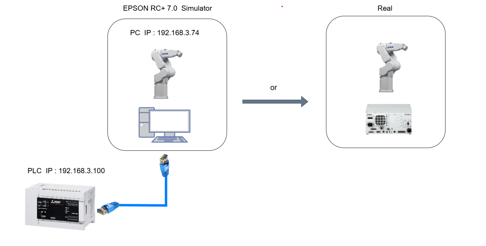
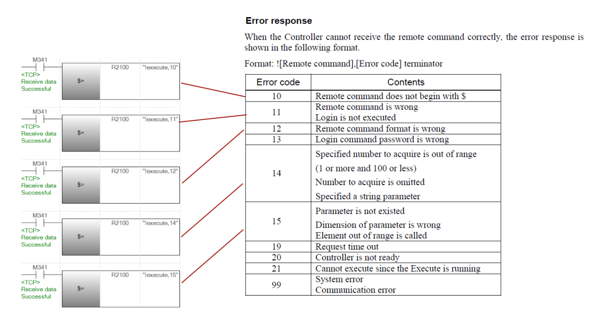

- **項目名稱 / Project Name**：
    
    FX5U 連接 EPSON ROBOT ，實現遠端控制<br>
    
    FX5U Connect to EPSON ROBOT , achieve remote control  <br>

- **支援 PLC / Support PLC**：
    
    EPSON ROBOT C4 Series (Ethernet)

- **使用協議格式 / Use the protocol format**：

    TCP / IP 

- **環境 / Environment**：
    


- **PLC 命令 / PLC Commands**：

    ```python  
 
    $Login,                        (※If no password is set)
    $Login,123                     (※Password = 123)
    $SetMotorsOn,0
    $SetMotorsOFF,0
    $GetStatus,0
    $Reset,0
    $execute,"go p0"
    $execute,"go p1"
    $execute,"go p2"
    $execute,"go p3"
    $execute,"home"
    $execute,"power High"
    $execute,"power Low"
    $execute,"Speed 100"
    $execute,"Accel 100,100"
    $execute,"SpeedS 2000"
    $execute,"AccelS 25000,25000"

    ```
- **參考 / References**：
    
    中文 : 
        EPSON RC+ 7.0 使用指南  /  Page 321 

    English :
        EPSON RC+7.0 User's Guide PDF  /  Page 373


- **異常代碼 / Error code**：

    